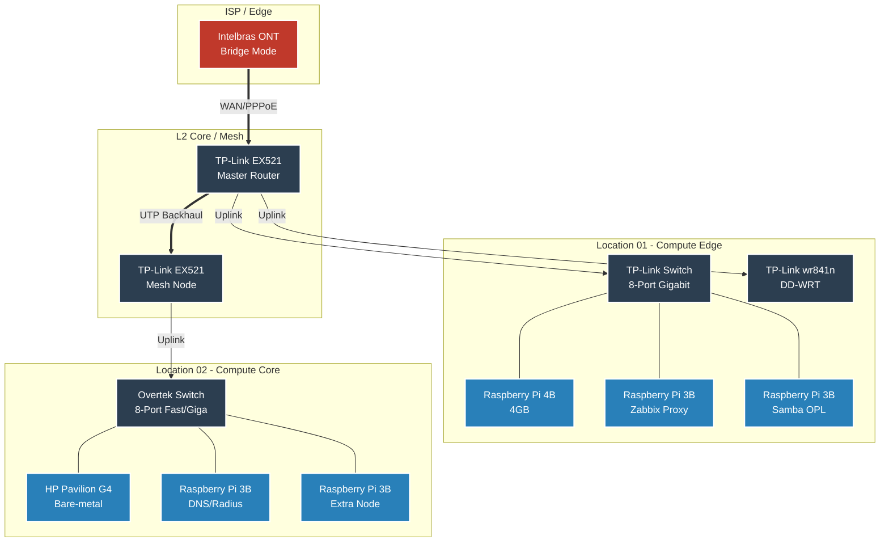
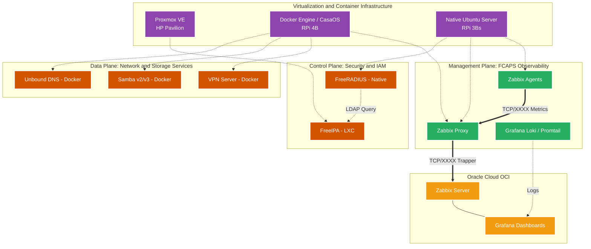

<h6 align="right">Leia esta página em <a href="https://github.com/kevindexter22/Dr-Hardware-Autonet/blob/main/01-infrastructure/README.md" target="_blank" rel="noopener noreferrer">🇧🇷 Português</a></h6>

# 🏠 Infrastructure

### 📝 Description

The main goal of this folder is to bring all the information about the physical structure, devices/hardware, and services for my homelab.

Here, I will show what I am building. I will also show some theory, the reason for the implementation, config files/scripts, and problems with their solutions over time.

##

### 🏗️ Topology / Architecture

#### L1-L2 Diagram: Physical Topology e Data Link

#### L3-L7: Logical Architecture and OSS

##

Today, the infrastructure topology is like the diagrams above:

We have an ONT Intelbras 121AC (from my ISP) in bridge mode and connected to the TP-Link EX521 Mesh Router.

The main core has 2 TP-Link mesh routers in two different places. This gives better coverage. They are connected via UTP Cable for more stability. The main switch is an 8-Port Gigabit Switch.

In Location 01, I have 3 Raspberry Pis. Two are model 3B and one is model 4B with 4GB of memory. They all run Ubuntu 24.04 LTS as the operating system.

On one Raspberry Pi 3B, I am running Zabbix Proxy. On the other, I have Samba to use with OPL for local network access. (Because OPL is only compatible with the SMB 1.0 protocol and it has many vulnerabilities, this server is limited to local access only. It is only turned on when I use it).

On the Raspberry Pi 4B, I use Casa OS (which is basically a Docker server with a visual interface for management). On it, I run many containers with services for my personal use.

In Location 02, I have an HP Pavilion G4 notebook with Proxmox to run VMs and LXC Containers. I also have 4 Raspberry Pi 3Bs where I will run some more services.

I also have VMs in Oracle Cloud, where I store some servers that work directly with my infrastructure.

On the routers and servers, I make the necessary configs to guarantee the safety and integrity of the infrastructure. For example, separate Wi-Fi networks (for guests and IoT devices), firewalls, and other necessary measures.

Because I don't have physical space for a rack to put all the homelab devices and servers together, I keep everything decentralized, depending on the space and the services. Even with this detail, all devices are managed on the same local network.

##

### 🚀 Completed Work

#### 🗄️ Hardware and Virtualization
- [x] Raspberry Pi 4B 4GB: Running CasaOS, which is a simple environment to manage Docker containers
- [x] HP Pavilion G4: Running Proxmox VE, which is a Hypervisor to manage VMs and containers (LXC)
- [x] Raspberry Pi 3B: I have some running Ubuntu 24.04 LTS with specific services

#### 🤖 Automation and Scripting
##### 🧩 *Shell Script (Bash)*
- [x] Ubuntu Post-Install: Automation script to configure and standardize Desktops and Notebooks
- [x] Update Tool: Script for central updates (apt, snap, flatpak, and .deb packages)
- [x] Drive Persistence: Guarantees the persistence of External HD mount points for network services and OPL
- [x] Smart Shutdown: Script for smart shutdown of the Samba_OPL Host based on the PS2 state

#### 📊 Monitoring and Services
- [x] Zabbix Stack: Main server on OCI with Proxy for decentralized network monitoring
- [x] Grafana: Advanced dashboards to see metrics and hardware health
- [x] Samba server (OPL): Dedicated file server to load PS2 games
- [x] Docker Ecosystem: Many microservices implemented via Docker
- [x] FreeIPA: Central management of identities, authentications, and policies

#### 📡 Network Devices (Physical)
- [x] ONT/Modem: Intelbras - installed by my ISP
- [x] Main/Secondary Router: 2x TP-Link EX521 - Making a mesh network for better coverage
- [X] Replaced the main switch with a Gigabit switch
- [x] Switch: Overtek OT2808S/W/UX 8 Ports - Where I connect devices that don't need gigabit speed
- [x] Router TP-Link wr841n with OpenWRT - Where I connect my IP cameras
##

### 🗓️ Roadmap (Future Steps)

#### 🗄️ Hardware and Virtualization
- [ ] Upgrade the HP Pavilion G4
- [ ] Buy new hardware (configuration and goal to be decided)

#### 🤖 Automation and Scripting
##### 🧩 *Shell Script (Bash)*
- [ ] Backup automation for config files and dump of the most important databases
- [ ] Healthcheck and connection script for the VPN Tunnel
- [ ] Script to generate Netbox reports
- [ ] Healthcheck script for FreeRADIUS
- [ ] Sync watchdog for MySQL Master-Master
- [ ] DNS Blacklist automation
- [ ] Backup configs for each server, service, and database

##### 💊 *Remediation Scripts*
- [ ] Zabbix + Proxmox API
- [ ] Zabbix + Genie: Automatic Wi-Fi channel change or remote reboot

##### 🏗️ *Infrastructure as Code (IaC) and Configuration*
- [ ] Microservices Provisioning with Terraform: Provision a complete structure on Proxmox
- [ ] IP Lifecycle: Use Terraform as a Netbox client checking available IPs
- [ ] "Post-Boot" Configuration: Connect SSH with Ansible and install the necessary services
- [ ] Template and immutability management: A process checks and downloads the current OS image and Ansible makes a template
- [ ] Ansible for ACS: Standardize Provisioning Flows and vparams in GenieACS

##### 🔄 *Orchestration and Management*
- [ ] GitOps: Store scripts and playbooks in repositories (GitHub) for versioning
- [ ] Rundeck Integration: Orchestrate the analysis cycle Redis → Gemini API → Action via Ansible/GenieACS

##### 👁️‍🗨️ *Intelligent Observability (AIOps)*
- [ ] Create Webhook Zabbix <-> Gemini API for Root Cause Analysis (RCA)
- [ ] Implement alert enrichment with Grafana Loki logs
- [ ] Validate auto-fix suggestions via Rundeck in the Homelab
- [ ] TR-181 Telemetry Dashboard in Grafana: View Signal/Noise and CPU of routers via Redis Data Source
- [ ] Predictive Analysis: Use Gemini to analyze signal drop trends in Redis before the client notices

#### 📊 Monitoring and Services
- [ ] Netbox: IP address management
- [ ] GenieACS: Access centralization and management via TR-069/TR-098 or TR-181
- [ ] Unbound DNS: Private DNS
- [ ] DNS Collector + Grafana LOKI: Collect and index DNS logs for analysis and observability
- [ ] Redundancy for Essential Services: Create backups for main services in case of failure
- [ ] Freeradius + MySQL: AAA Authentication with database for access control and accounting
- [ ] Zabbix VAE (Virtual Appliance Edition): Hardware Monitoring, SNMP, and Native Proxmox Integration
- [ ] Grafana: Creation of general dashboards

#### 📡 Network Devices (Physical)
- [ ] Replace the old TP-Link for cameras and improve the system

##

###### ℹ️ Part of the Dr. Hardware Autonet project - MIT License.
