<h6 align="right">Leia esta página em <a href="https://github.com/kevindexter22/Dr-Hardware-Autonet/blob/main/Infrastructure/README2.md" target="_blank" rel="noopener noreferrer">🇬🇧 Inglês</a></h6>

# 🏠 Infraestrutura

### 📝 Descrição

O objetivo principal desse diretório é trazer todas as informações ligadas à estrutura física, dispositivos/hardwares e serviços voltados ao meu homelab.

Trarei aqui a visão do que está sendo implementado, assim como um pouco da base teórica, finalidade da implementação, arquivos de configuração/scripts e problemas com suas possíveis soluções realizados ao longo do tempo.
##

### 🏗️ Topologia / Arquitetura

```mermaid
graph TD
    %% Styles
    classDef network fill:#383838,stroke:#FFFFFF,stroke-width:2px;
    classDef hardware fill:#383838,stroke:#FFFFFF,stroke-width:2px;
    classDef internet fill:#383838,stroke:#FFFFFF,stroke-width:2px,stroke-dasharray: 5 5;
    classDef services fill:#383838,stroke:#FFFFFF,stroke-width:2px, stroke-dasharray: 2 3;
    classDef oci fill:#383838,stroke:#FFFFFF,stroke-width:2px;

    %% 1. NETWORK EQUIPMENT
    subgraph Principal["1. Network Equipment"]
    subgraph S1 [CORE]
        ONT[ONT Intelbras - Bridge]:::network --> R_Mesh1[TP-Link EX521 Mesh]:::network
        R_Mesh1 --> R_Mesh2[TP-Link EX521 Mesh]:::network
        R_Mesh1 --> SW1[Switch TP-Link 8p]:::network
        R_Mesh1 --> R_Cams[TP-Link DD-WRT Cam]:::network
        R_Mesh2 ---> SW2[Switch Overtek 8p]:::network  
    end
    end
    
    %% 2. HARDWARE
    subgraph Principal02["2. Hardware"]
    subgraph S2 [Local 01]
        SW1 ---> RPi4B[Raspberry Pi 4B - CasaOS]:::hardware
        SW1 ---> RPi3B_2[Raspberry Pi 3B - Zabbix Proxy]:::hardware
        SW1 ---> RPi3B_1[Raspberry Pi 3B - Arquivos_OPL]:::hardware
    end
    subgraph S3 [Local 02]
        SW2 ---> HP[HP Pavilion - Proxmox VE]:::hardware
        SW2 ---> RPi3B_4[Raspberry Pi 3B - DNS Redundância]:::hardware
        SW2 ---> RPi3B_5[Raspberry Pi 3B - ???]:::hardware
        SW2 ---> RPi3B_6[Raspberry Pi 3B - ???]:::hardware
        SW2 ---> RPi3B_3[Raspberry Pi 3B - FreeRadius]:::hardware
    end
    end

    %% 3. SERVICES
    subgraph Principal03["3. SERVICES"]
    subgraph S4 [Services];
        HP --- PVE[Containeres LXC]:::services
        RPi3B_4 --- UNB2[Unbound DNS]:::services
        RPi3B_5 --- 01[???]:::services
        RPi3B_6 --- 02[???]:::services
        RPi3B_3 --- FreeRAD[FreeRADIUS]:::services
        RPi3B_3 --- BDMSQL[MySQL Master]:::services
        RPi4B --- Docker[Docker]:::services     
        RPi4B --- VPN[VPN Server]:::services
        RPi4B --- SMB2[Samba v2/3]:::services
        RPi4B --- ZA[Zabbix Agent]:::services
        RPi3B_2 --- ZA[Zabbix Agent]:::services
        RPi3B_2 --- ZP01[Zabbix Proxy 01]:::services
        RPi3B_1 --- SMB1[Samba v1]:::services
    end
    subgraph S5 [Containeres LXC];
        PVE --- FIPA[FreeIPA]:::services
    end
    subgraph S6 [Containeres Docker];
        Docker --- UNB[Unbound DNS]:::services
        Docker --- TRILLIUM[Trillium Note]:::services
        Docker --- SIYUAN[SiYuan Note]:::services
        Docker --- EMBY[Emby]:::services
        Docker --- MSPEED[MySpeed]:::services
        Docker --- N8N[N8N]:::services
        Docker --- ZP02[Zabbix Proxy 02]:::services
    end
    end

    %% 4. Internet (The Bridge)
    subgraph S7 [4. ISP/Internet]
           internet[Internet]:::internet
    end

    %% 5. Oracle Cloud Infrastructure
    subgraph S8 [5. OCI]
        ZS[Zabbix Server - Grafana]:::oci
    end

    %% Conections of data flow
    ONT <--> S7
    S7 <--> S8
    
    %% Logical conections
    ZA -.-> |Metrics| ZS
    ZP01 -.-> |Metrics| ZS 
    ZP02 -.-> |Metrics| ZS

    %% --- Set collor on conections ---
    
    linkStyle 0,1,2,3,4 stroke:#3498db,stroke-width:3px;
    linkStyle 5,6,7,8,9,10,11,12 stroke:#7FFFD4,stroke-width:3px;
    linkStyle 13,14,15,16,17,18,19,20,21,22,23,24,25,26,27,28,29,30,31 stroke:#E6E6FA,stroke-width:3px;
    linkStyle 32 stroke:#FFFF00,stroke-width:3px;
    linkStyle 33,34,35,36 stroke:#F5FFFA,stroke-width:3px,stroke-dasharray: 5 5;

```

Atualmente a topologia da infraestrutura está conforme o diagrama acima:

Temos uma ONT Intelbras 121AC (vinda do meu ISP) configurada em bridge e linkada ao Roteador Mesh TP-Link EX521.

O core principal conta com 2 roteadores TP-Link em mesh, em dois locais diferentes, para uma maior cobertura e estão conectados via Cabo UTP para maior estabilidade, assim como o switch principal é um Switch Gigabit com 8 Portas.

No local 01 possui 3 Raspberry Pi, sendo 2 modelo 3B e uma o modelo 4B com 4GB de memória. Todos com Ubuntu 24.04 LTS como sistema operacional. 

Em uma das Raspberry Pi 3B estou rodando o Zabbix Proxy e na outra possuo o Samba para utilização junto ao OPL para acesso local via rede (como o OPL só tem compatibilidade com o protocolo SMB 1.0 e ele possui diversas vulnerabilidades, esse servidor fica limitado ao acesso local somante e só é ligado nos momentos de utilização).

Na Raspberry Pi 4B estou utilizando o Casa OS (que é basicamente um servidor docker com interface gráfica para gerência).
Nele estou rodando diversos containeres com serviços direcionados ao meu uso pessoal.

No local 02 possuo um notebook HP Pavilion G4 com Proxmox para execução de VMs e Containers LXC e 4 Raspberry Pi 3B onde vou executar mais alguns serviços. 

Nos roteadores e servidores são feitas as configurações necessárias para garantir a segurança e integridade da infraestrutura, tais como redes wifi separadas da principal (para convidados e dispositivos IoT), firewalls e demais medidas necessárias. 

Como não disponho de espaço físico para um rack que centralizaria todos os dispositivos e servidores do homelab, mantenho tudo descentralizados, de acordo com espaço do local e serviços que serão executados. Apesar desse detalhe, os dispositivos são gerenciados dentro da mesma rede local.

##

### 🚀 Implementações Realizadas

#### 🗄️ Hardware e Virtualização
- [x] Raspberry Pi 4B 4GB: Rodando CasaOS que é um ambiente simplificado para gestão de containers Docker
- [x] HP Pavilion G4: Rodando Proxmox VE que é um Hypervisor para gerenciamentos de VMs e cotainers (LXC)
- [x] Raspberry Pi 3B: Possuo algumas rodando o Ubuntu 24.04 LTS com serviços específicos

#### 🤖 Automação e Scripting
##### 🧩 *Shell Script (Bash)*
- [x] Ubuntu Post-Install: Script de automação para configuração e padronização de Desktops e Notebooks
- [x] Update Tool: Script para atualização centralizada (apt, snap, flatpak e pacotes.deb)
- [x] Drive Persistence: Garante a persistência de pontos de montagem de HDs Externos para serviços de rede e OPL
- [x] Smart Shutdown: Script para desligamento inteligente do Host Samba_OPL baseado no estado do PS2

#### 📊 Monitoramento e Serviços
- [x] Zabbix Stack: Servidor principal na OCI com Proxy para monitoramento de rede descentralizado
- [x] Grafana: Dashboards avançadas para visualizações de métricas e saúde do hardware
- [x] Samba server (OPL): Servidor de arquivos dedicado para carregamento de jogos de PS2
- [x] Docker Ecosystem: Diversos microsserviços implementados via Docker

#### 📡 Ativos de Redes (Físicos)
- [x] ONT/Modem: Intelbras - instalado pelo meu ISP
- [x] Roteador Principal/Secundário: 2x TP-Link EX521 - Formando uma rede mesh para maior cobertura
- [X] Substituição do switch principal por um switch Gigabit
- [x] Switch: Overtek OT2808S/W/UX 8 Portas - Onde ligo meus dispositivos que não precisam estar em gigabit
- [x] Roteador TP-Link wr841n com OpenWRT - Onde conecto minhas câmeras IP
##

### 🗓️ Roadmap (Próximos Passos)

#### 🗄️ Hardware e Virtualização
- [ ] Upgrade no HP Pavilion G4
- [ ] Aquisição de um novo hardware (configuração e finalidade a decidir)

#### 🤖 Automação e Scripting
##### 🧩 *Shell Script (Bash)*
- [ ] Automação de Backups dos arquivos de configuração e dump de bancos mais importantes
- [ ] Script de healthcheck e conectividade para o Túnel VPN
- [ ] Script para gerar relatórios do Netbox
- [ ] Script de healthcheck para FreeRADIUS
- [ ] Watchdog de sincronismo do MySQL Master-Master
- [ ] Automação de DNS Blacklist (Pi-hole "Caseiro" com Unbound)
- [ ] Backup de configurações de cada servidor,serviço e banco de dados

##### 💊 *Scripts de Remediação*
- [ ] Zabbix+Proxmox API
- [ ] Zabbix+Genie: Troca automática de canal wi-fi ou reboot remoto

##### 🏗️ *Infraestrutura como Código (IaC) e Configuração*
- [ ] Provisionamento de Microserviços com Terraform: Provisionar uma estrutura completa no proxmox
- [ ] Ciclo de Vida de IPs: Utilizar Terraform como cliente do Netbox consultando IPs disponíveis
- [ ] Configuração "Post-Boot": Conectar SSH com Ansible e instalar os serviços necessários
- [ ] Gestão de template e imutabilidade: Um processo valida e baixa a imagem atual do S.O. e o ansible converte em template
- [ ] Ansible para ACS: Padronização de Provisioning Flows e vparams no GenieACS

##### 🔄 *Orquestração e Gestão*
- [ ] GitOps: Armazenamento dos scripts e playbooks em repositórios (GitHub) para versionamento
- [ ] Rundeck Integration: Orquestrar o ciclo de análise Redis → Gemini API → Ação via Ansible/GenieACS

##### 👁️‍🗨️ *Observabilidade Inteligente (AIOps)*
- [ ] Criar Webhook Zabbix <-> Gemini API para análise de causa raiz (RCA)
- [ ] Implementar enriquecimento de alertas com logs do Grafana Loki
- [ ] Validar sugestões de correção automática via Rundeck no Homelab
- [ ] Dashboard de Telemetria TR-181 no Grafana: Visualização de Sinal/Ruído e CPU dos roteadores via Redis Data Source
- [ ] Análise Preditiva: Usar Gemini para analisar tendências de queda de sinal no Redis antes que o cliente perceba

#### 📊 Monitoramento e Serviços
- [ ] Netbox: Gerenciamento de endereços IP
- [ ] GenieACS: Centralização de acesso e gerenciamento via TR-069/TR-098 ou TR-181
- [ ] FreeIPA: Gerenciamento centralizado de identidades, autenticações e políticas
- [ ] Unbound DNS: DNS privado 
- [ ] DNS Colector + Grafana LOKI: Coleta e indexação de logs DNS para análise e observabilidade
- [ ] Redundância de Serviços Essenciais: Criar backup dos serviços principais para caso de falhas
- [ ] Freeradius + MySQL: Autenticação AAA com banco de dados para controle de acesso e accounting
- [ ] Zabbix VAE (Virtual Appliance Edition): Monitoramento de Hardware, SNMP e Integração Nativa com Proxmox
- [ ] Grafana: Criação de dashboards em geral

#### 📡 Ativos de Redes (Físicos)
- [ ] Substituição do TP-Link antigo das câmeras e melhorias no sistema

##

###### ℹ️ Parte do projeto Dr. Hardware Autonet - Licenciado sob a licença MIT.
