<h6 align="right">Read this page in <a href="https://github.com/kevindexter22/Dr-Hardware-Autonet/blob/main/Infrastructure/README.md" target="_blank" rel="noopener noreferrer">🇧🇷 Portuguese</a></h6>

<h6 align="right">Read this page in <a href="https://github.com/kevindexter22/Dr-Hardware-Autonet/blob/main/README.md" target="_blank" rel="noopener noreferrer">🇧🇷 Portuguese</a></h6>

# 🏠 Infrastructure

### 📝 Description

The main goal of this folder is to show all the information about the physical structure, devices, hardware, and services in my homelab.

Here, I will share what is being built, the basic theory, the reason for each part, configuration files, scripts, and problems I fixed over time.
---

### 🏗️ Topology / Architecture

```mermaid
graph TD
    %% Styles
    classDef network fill:#383838,stroke:#FFFFFF,stroke-width:2px;
    classDef hardware fill:#383838,stroke:#FFFFFF,stroke-width:2px;
    classDef internet fill:#383838,stroke:#FFFFFF,stroke-width:2px,stroke-dasharray: 5 5;
    classDef services fill:#383838,stroke:#FFFFFF,stroke-width:2px, stroke-dasharray: 2 3;
    classDef oci fill:#383838,stroke:#FFFFFF,stroke-width:2px;

    %% 1. NETWORK EQUIPMENT
    subgraph Principal["1. Network Equipment"]
    subgraph S1 [Location 01]
        ONT[Intelbras ONT - Bridge]:::network --> R_Mesh1[Huawei WS5800 Mesh]:::network
        R_Mesh1 --> SW1[Overtek 8p Switch]:::network
        SW1 --> R_Cams[TP-Link OpenWRT Cam]:::network    
    end
    subgraph S2 [Location 02]
        R_Mesh1 --> R_Mesh2[Huawei WS5800 Mesh]:::network
    end
    end
    
    %% 2. HARDWARE
    subgraph Principal02["2. Hardware"]
    subgraph S3 [Location 01]
        SW1 ---> RPi3B_1[Raspberry Pi 3B - OPL_Files]:::hardware
        R_Mesh1 ---> RPi4B[Raspberry Pi 4B - CasaOS]:::hardware
        SW1 ---> RPi3B_2[Raspberry Pi 3B - Zabbix Proxy]:::hardware
    end
    subgraph S4 [Location 02]
        R_Mesh2 ---> HP[HP Pavilion - Proxmox VE]:::hardware
    end
    end

    %% 3. SERVICES     
    subgraph S5 [3. Services];
        RPi3B_1 --- SMB1[Samba]:::services
        RPi4B --- Docker[Docker]:::services
        RPi4B --- VPN[VPN Server]:::services
        RPi4B --- ZA[Zabbix Agent]:::services
        RPi3B_2 --- ZA[Zabbix Agent]:::services
        RPi3B_2 --- ZP[Zabbix Proxy]:::services
        HP --- PVE[Proxmox VE]:::services        
    end

    %% 4. Internet (The Bridge)
    subgraph S6 [4. ISP/Internet]
            internet[Internet]:::internet
    end

    %% 5. Oracle Cloud Infrastructure
    subgraph S7 [5. OCI]
        ZS[Zabbix Server - Grafana]:::oci
    end

    %% Connections of data flow
    ONT --> S6
    S6 --> S7
    
    %% Logical connections
    ZA -.-> |Metrics| ZS
    ZP -.-> |Metrics| ZS 

    %% --- Set color on connections ---
    
    linkStyle 0 stroke:#3498db,stroke-width:3px;
    linkStyle 1,3,5,7 stroke:#7FFFD4,stroke-width:3px;
    linkStyle 2,4,6 stroke:#836FFF,stroke-width:3px;
    linkStyle 8,9,10,11,12,13,14 stroke:#E6E6FA,stroke-width:3px;
    linkStyle 15 stroke:#FFFF00,stroke-width:3px;
    linkStyle 16,17,18 stroke:#F5FFFA,stroke-width:3px,stroke-dasharray: 5 5;

```

Currently, the infrastructure topology is like the diagram above:

I have an Intelbras 121AC ONT (from my ISP). It is in bridge mode and connected to a Huawei WS5800 Mesh Router.

The main router (Huawei) has two towers for better signal. They use a UTP cable for a stable connection.

I don't have enough physical space for a rack. Because of this, the servers are in different places. They are in different rooms, but I manage all of them on the same local network.

##

### 🚀 Completed Work

#### 🗄️ Hardware and Virtualization
- [x] Raspberry Pi 4B 4GB: Running CasaOS (a simple system to manage Docker containers)
- [x] HP Pavilion G4: Running Proxmox VE (a tool to manage Virtual Machines and Containers)
- [x] Raspberry Pi 3B: I have some units running Ubuntu 24.04 LTS for specific tasks

#### 🤖 Automation and Scripting

🧩 Shell Script (Bash)
[x] Ubuntu Post-Install: An automation script to configure and standardize Desktops and Laptops.

[x] Update Tool: A script for central updates (apt, snap, flatpak, and .deb packages).

[x] Drive Persistence: This helps keep external HDDs connected for network services and OPL.

[x] Smart Shutdown: A script to turn off the Samba server automatically when the PS2 is off.

📊 Monitoring and Services
[x] Zabbix Stack: Main server on OCI with a Proxy to monitor the local network.

[x] Grafana: Advanced dashboards to see hardware health and metrics.

[x] Samba server (OPL): A dedicated file server to load PS2 games.

[x] Docker Ecosystem: Many small services running on Docker.

📡 Network Devices (Physical)
[x] ONT/Modem: Intelbras - provided by my ISP.

[x] Main/Secondary Router: 2x Huawei WS5800 - They create a mesh network for better coverage.

[x] Switch: Overtek 8 Ports - For devices that don't need gigabit speed.

[x] TP-Link wr841n with OpenWRT: Used to connect my IP cameras.

🗓️ Roadmap (Future Steps)
🗄️ Hardware and Virtualization
[ ] Upgrade the HP Pavilion G4.

[ ] Buy new hardware (specs and goal to be decided).

🤖 Automation and Scripting
🧩 Shell Script (Bash)
[ ] Automated backups for configuration files and databases.

[ ] Connectivity check script for the VPN Tunnel.

[ ] Script to create reports for PHPIPAM.

[ ] Healthcheck script for FreeRADIUS.

[ ] Watchdog for MySQL Master-Master synchronization.

[ ] DNS Blacklist automation (Personal "Pi-hole" with Unbound).

💊 Fixing Scripts (Remediation)
[ ] Zabbix + Proxmox API.

[ ] Zabbix + Genie: Automatic Wi-Fi channel change or remote reboot.

🏗️ Infrastructure as Code (IaC) and Configuration
[ ] Setup services with Terraform: Create a full structure in Proxmox.

[ ] IP Life Cycle: Use Terraform with phpIPAM to find available IPs.

[ ] "Post-Boot" Configuration: Use Ansible to install services via SSH.

[ ] Template Management: A process to download OS images and convert them into templates using Ansible.

[ ] Ansible for ACS: Standardize flows in GenieACS.

🔄 Orchestration and Management
[ ] GitOps: Save scripts and playbooks on GitHub for version control.

[ ] Rundeck Integration: Connect Redis, Gemini API, and Ansible for better management.

👁️‍🗨️ Intelligent Observability (AIOps)
[ ] Create a link between Zabbix and Gemini API to analyze problems.

[ ] Add Grafana Loki logs to alerts.

[ ] Test automatic fixes using Rundeck in the Homelab.

[ ] TR-181 Dashboard in Grafana: See Signal/Noise and CPU of routers.

[ ] Predictive Analysis: Use AI to find signal problems before they happen.

📊 Monitoring and Services
[ ] PHPIPAM: Manage IP addresses.

[ ] GenieACS: Central management for devices (TR-069/TR-181).

[ ] FreeIPA: Central identity and password management.

[ ] Prometheus: Real-time monitoring and alerts.

[ ] Pi-hole + Unbound DNS: Private DNS to block ads.

[ ] DNS Collector + Grafana LOKI: Collect and analyze DNS logs.

[ ] Redundancy: Create backups for essential services.

[ ] Freeradius + MySQL: Authentication and access control.

[ ] Zabbix VAE: Native Proxmox integration and hardware monitoring.

[ ] Grafana: Create general dashboards.

📡 Network Devices (Physical)
[ ] Replace or update the main/secondary routers.

[ ] Replace the current switch with a Gigabit switch.

[ ] Replace the old TP-Link for the cameras and improve the system.

ℹ️ Part of the Dr. Hardware Autonet project - MIT License.
