<h6 align="right">Read this page in <a href="https://github.com/kevindexter22/Dr-Hardware-Autonet/blob/main/Infrastructure/README.md" target="_blank" rel="noopener noreferrer">🇧🇷 Portuguese</a></h6>

# 🏠 Infrastructure

### 📝 Description

The main goal of this folder is to provide all information about the physical structure, devices/hardware, and services in my homelab.

Here, I will show what is being built, the basic theory, the reason for the implementation, configuration files/scripts, and problems with their solutions found over time.
##

### 🏗️ Topology / Architecture

```mermaid
graph TD
    %% Styles
    classDef network fill:#383838,stroke:#FFFFFF,stroke-width:2px;
    classDef hardware fill:#383838,stroke:#FFFFFF,stroke-width:2px;
    classDef internet fill:#383838,stroke:#FFFFFF,stroke-width:2px,stroke-dasharray: 5 5;
    classDef services fill:#383838,stroke:#FFFFFF,stroke-width:2px, stroke-dasharray: 2 3;
    classDef oci fill:#383838,stroke:#FFFFFF,stroke-width:2px;

    %% 1. NETWORK EQUIPMENT
    subgraph Principal["1. Network Equipment"]
    subgraph S1 [Local 01]
        ONT[ONT Intelbras - Bridge]:::network --> R_Mesh1[Huawei WS5800 Mesh]:::network
        R_Mesh1 --> SW1[Switch Overtek 8p]:::network
        SW1 --> R_Cams[TP-Link OpenWRT Cam]:::network    
    end
    subgraph S2 [Local 02]
        R_Mesh1 --> R_Mesh2[Huawei WS5800 Mesh]:::network
    end
    end
    
    %% 2. HARDWARE
    subgraph Principal02["2. Hardware"]
    subgraph S3 [Local 01]
        SW1 ---> RPi3B_1[Raspberry Pi 3B - Arquivos_OPL]:::hardware
        R_Mesh1 ---> RPi4B[Raspberry Pi 4B - CasaOS]:::hardware
        SW1 ---> RPi3B_2[Raspberry Pi 3B - Zabbix Proxy]:::hardware
    end
    subgraph S4 [Local 02]
        R_Mesh2 ---> HP[HP Pavilion - Proxmox VE]:::hardware
    end
    end

    %% 3. SERVICES     
    subgraph S5 [3. Services];
        RPi3B_1 --- SMB1[Samba]:::services
        RPi4B --- Docker[Docker]:::services
        RPi4B --- VPN[VPN Server]:::services
        RPi4B --- ZA[Zabbix Agent]:::services
        RPi3B_2 --- ZA[Zabbix Agent]:::services
        RPi3B_2 --- ZP[Zabbix Proxy]:::services
        HP --- PVE[Proxmox VE]:::services        
    end

    %% 4. Internet (The Bridge)
    subgraph S6 [4. ISP/Internet]
           internet[Internet]:::internet
    end

    %% 5. Oracle Cloud Infrastructure
    subgraph S7 [5. OCI]
        ZS[Zabbix Server - Grafana]:::oci
    end

    %% Conections of data flow
    ONT --> S6
    S6 --> S7
    
    %% Logical conections
    ZA -.-> |Metrics| ZS
    ZP -.-> |Metrics| ZS 

    %% --- Set collor on conections ---
    
    linkStyle 0 stroke:#3498db,stroke-width:3px;
    linkStyle 1,3,5,7 stroke:#7FFFD4,stroke-width:3px;
    linkStyle 2,4,6 stroke:#836FFF,stroke-width:3px;
    linkStyle 8,9,10,11,12,13,14 stroke:#E6E6FA,stroke-width:3px;
    linkStyle 15 stroke:#FFFF00,stroke-width:3px;
    linkStyle 16,17,18 stroke:#F5FFFA,stroke-width:3px,stroke-dasharray: 5 5;

```

Currently, the infrastructure topology follows the plan below:

We have an Intelbras 121AC ONT (from my ISP) in bridge mode, connected to the Huawei WS5800 Mesh Router.

The main router (Huawei) has two towers for better coverage. Both are connected via UTP cable for more stability.

I don't have physical space for a rack to centralize the homelab. So, the servers are in different places, depending on the space and the service they run.

Because of this, the servers and devices stay in separate rooms, but I manage them on the same local network.

##

### 🚀 Completed Work

#### 🗄️ Hardware and Virtualization
- [x] Raspberry Pi 4B 4GB: Running CasaOS, which is a simple environment to manage Docker containers
- [x] HP Pavilion G4: Running Proxmox VE, which is a Hypervisor to manage VMs and containers (LXC)
- [x] Raspberry Pi 3B: I have some units running Ubuntu 24.04 LTS with specific services

#### 🤖 Automation and Scripting
##### 🧩 *Shell Script (Bash)*
- [x] Ubuntu Post-Install: Automation script to configure and standardize Desktops and Laptops
- [x] Update Tool: Script for centralized updates (apt, snap, flatpak, and .deb packages)
- [x] Drive Persistence: Ensures external HDDs stay connected for network services and OPL
- [x] Smart Shutdown: Script to turn off the Samba_OPL host automatically based on the PS2 state

#### 📊 Monitoring and Services
- [x] Zabbix Stack: Main server on OCI with Proxy for decentralized network monitoring
- [x] Grafana: Advanced dashboards for metrics and hardware health
- [x] Samba server (OPL): Dedicated file server to load PS2 games
- [x] Docker Ecosystem: Several microservices running via Docker

#### 📡 Network Devices (Physical)
- [x] ONT/Modem: Intelbras - installed by my ISP
- [x] Main/Secondary Router: 2x Huawei WS5800 - Creating a mesh network for better coverage
- [x] Switch: Overtek 8 Ports - Where I connect devices that don't need gigabit speed
- [x] TP-Link router with OpenWRT - Where I connect my IP cameras
##

### 🗓️ Roadmap (Future Steps)

#### 🗄️ Hardware and Virtualization
- [ ] Upgrade the HP Pavilion G4
- [ ] Buy new hardware (configuration and goal to be decided)

#### 🤖 Automation and Scripting
##### 🧩 *Shell Script (Bash)*
- [ ] Automated backups for configuration files and important databases
- [ ] Healthcheck and connectivity script for the VPN Tunnel
- [ ] Script to generate reports for PHPIPAM
- [ ] Healthcheck script for FreeRADIUS
- [ ] Watchdog for MySQL Master-Master synchronization
- [ ] DNS Blacklist automation (DIY "Pi-hole" with Unbound)

##### 💊 *Remediation Scripts*
- [ ] Zabbix + Proxmox API
- [ ] Zabbix + Genie: Automatic Wi-Fi channel change or remote reboot

##### 🏗️ *Infrastructure as Code (IaC) and Configuration*
- [ ] Provisioning Microservices with Terraform: Create a full structure in Proxmox
- [ ] IP Life Cycle: Use Terraform with phpIPAM to check available IPs
- [ ] "Post-Boot" Configuration: Use Ansible to install services via SSH
- [ ] Template and immutability management: A process to download OS images and convert them into templates using Ansible
- [ ] Ansible for ACS: Standardize Provisioning Flows and vparams in GenieACS

##### 🔄 *Orchestration and Management*
- [ ] GitOps: Save scripts and playbooks on GitHub for version control
- [ ] Rundeck Integration: Orchestrate analysis cycle Redis → Gemini API → Action via Ansible/GenieACS

##### 👁️‍🗨️ *Intelligent Observability (AIOps)*
- [ ] Create Zabbix <-> Gemini API Webhook for root cause analysis (RCA)
- [ ] Add Grafana Loki logs to alert messages
- [ ] Test automatic fixes via Rundeck in the Homelab
- [ ] TR-181 Telemetry Dashboard in Grafana: Signal/Noise and CPU of routers via Redis Data Source
- [ ] Predictive Analysis: Use AI to analyze signal problems in Redis before the client notices

#### 📊 Monitoring and Services
- [ ] PHPIPAM: IP address management
- [ ] GenieACS: Central management for devices via TR-069/TR-098 or TR-181
- [ ] FreeIPA: Central identity, authentication, and policy management
- [ ] Prometheus: Monitoring and metrics with real-time alerts
- [ ] Pi-hole + Unbound DNS: Private DNS with ad-blocking
- [ ] DNS Collector + Grafana LOKI: Collect and analyze DNS logs
- [ ] Redundancy for Essential Services: Create backups for main services
- [ ] FreeRADIUS + MySQL: AAA authentication with database for access control
- [ ] Zabbix VAE (Virtual Appliance Edition): Hardware monitoring and native Proxmox integration
- [ ] Grafana: Create general dashboards

#### 📡 Network Devices (Physical)
- [ ] Replace or update the Main/Secondary routers
- [ ] Replace the current switch with a Gigabit switch
- [ ] Replace the old TP-Link for cameras and improve the system

##

###### ℹ️ Part of the Dr. Hardware Autonet project - MIT License.
